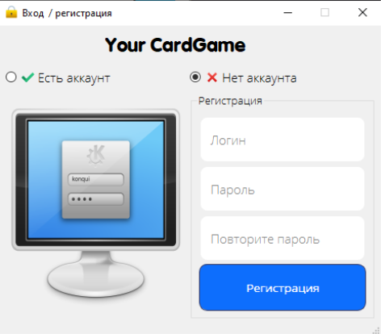
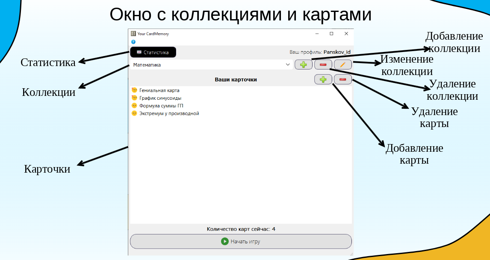
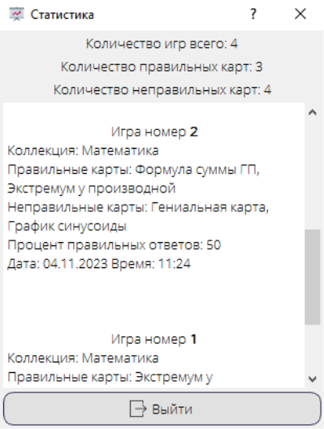

# Your CardMemory

    <h1>  
Смысл приложения
  <h1>
    
<h3>
  Смысл приложения:
</h3>
    
_Your CardMemory -  приложение для тренировки памяти, в котором можно создавать свои коллекции с карточками, которые выглядят как бумажка с передней и задней стороны._
    
---
  <h1>
    Процесс использования
  </h1>
  <h2>
     1. Вход / регистрация
  </h2>

  <h2>
     2. Открытие нужной коллекции / создание / изменение / удаление
  </h2>

  <h2>
     3. Окна для действий над коллекциями
  </h2>

  <h2>
     4. Окно для добавления карт
  </h2>

  <h2>
     5. Начало игры, выбор количества карт перед началом игры
  </h2>

  <h2>
     6. Конец игры
  </h2>

  <h2>
     7. Меню статистики
  </h2>

